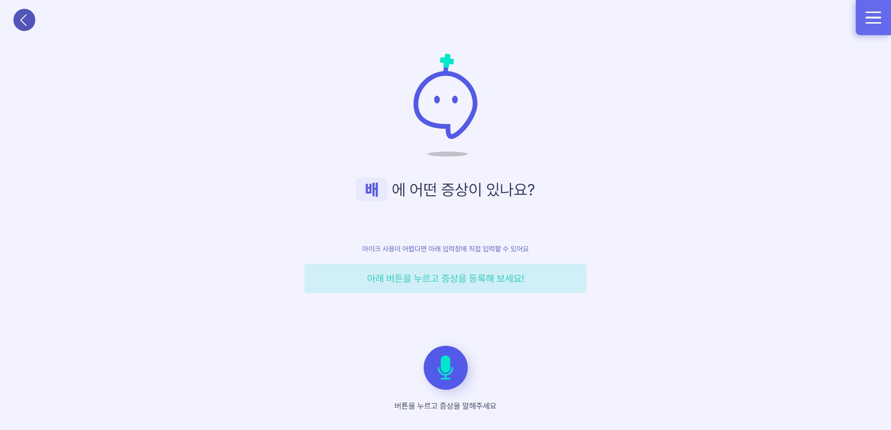
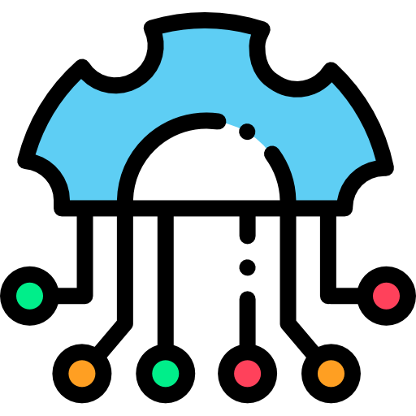
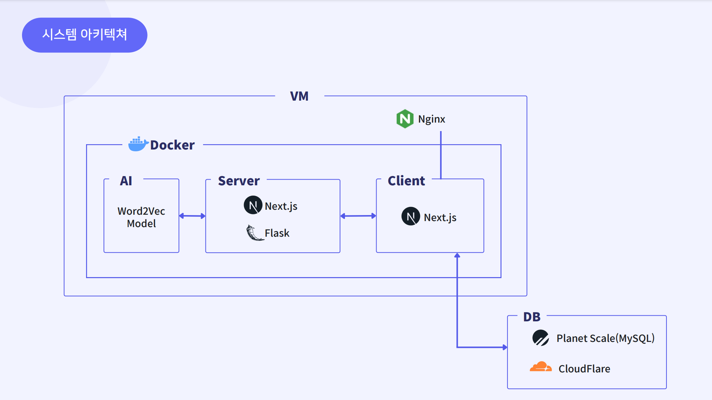
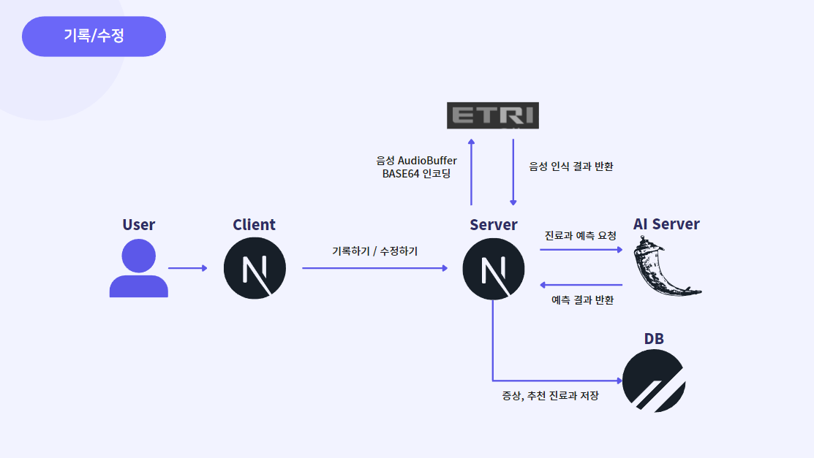
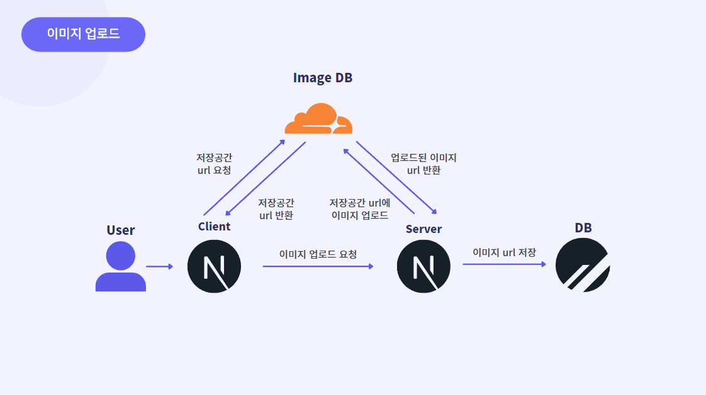
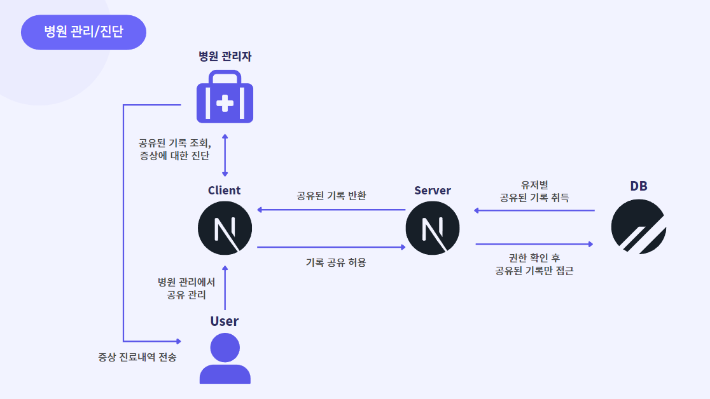
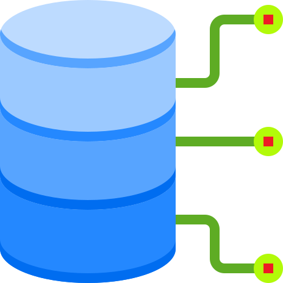

# BODYTORY

<div align='center'>
<p align="center">

</p>
<p align="center">
<a href="https://kdt-ai5-team01.elicecoding.com/">바디토리 체험하기!</a>
</p>
<p align="center">
<b>바디토리</b>는 <b>전국 모든 병원들과 연결되있다는 가정</b>하에<br/>     
국민들의 <b>사회권 개선</b>과 <b>국민건강 증진을 희망하는 바람</b>에서 만들어진<br/>
<b>가상의 프로젝트</b>입니다.
</p>
</div>


##  **바디토리 멤버**

<table>
  <tr>
    <td align="center"><a href="https://github.com/chspower1"><br /><sub><b>조호성</b></sub></a><br />
    
    
    
    </td>
    <td align="center"><a href="https://github.com/hihisohi"><br /><sub><b>정소희</b></sub></a><br />
    
    
    
    </td>
    <td align="center"><a href="https://github.com/KimKW1007"><br /><sub><b>김경원</b></sub></a><br />
    
    
    </td>
    <td align="center"><a href="https://github.com/Ryong-E"><br /><sub><b>한동룡</b></sub></a><br />
    
    
    </td>
    <td align="center"><a href="https://github.com/Peelsob4d"><br /><sub><b>오다현</b></sub></a><br />
    
    
    
    </td>
   
  </tr>
  
</table>
<br/>

##  **바디토리는?**

### 이런 경험 한번씩 있으신가요?

- 지금 **발생한 증상**이 이전에도 **같은 증상**이 있었는지 고민한 적이 있으신가요??
- 몸이 아픈데 **어떤 진료과**에 가야 하는지 헷갈리시나요?
- 병원에 갔는데 **증상이 명확하게 떠오르지 않아서** 애먹은적이 있으신가요?
- 예전에 진료받았던 내용이 **기억나지 않아서** 아쉬웠던 적이 있으신가요?

그렇다면 **바디토리**(Bodytory)에서 **내 몸의 증상**들을 부위별로 **기록하고**, **진료과**를 **추천**받아보세요!  
<a href="https://kdt-ai5-team01.elicecoding.com/about/bodytory">바디토리 사용 방법 보러가기!
</a>

### 바디토리는 이런 분들을 위해 만들어졌어요!

- **건강관리 목적**으로 **자신의 몸 상태를 기록하고 관리**하고 싶은 분들
- 매일 자신의 **증상을 기록할 필요**가 있는 **만성질환자** 분들
- **사소한 변화**가 **병원 진료 시 중요하게 작용**하시는 분들

### 바디토리는 이런 신념으로 만들어졌어요!

- 대화형 인터페이스로 좀 더 친숙한 느낌을 내고 싶었고 보편적인 웹 사이트 보다는 하나의 프로그램 같이 표현하고 싶었어요!
- 누구나 쉽게 사용할 수 있도록 직관적이고 단순한 구조를 추구했어요!
- 단순 기록을 넘어 병원 찾기,진료과목 추천,병원에 공유 등 기능으로 사용자들의 건강증진에 도움이 되고 싶었어요!
  <br/>
  <br/>

### 토리 디자인

- 토리는 보이스 AI 어시스턴트 컨셉으로 작업했어요!
- 바디토리의 건강 도우미 토리 디자인  
  
  
  <br/>
- 토리 모션 디자인

  
  
  
  
  

  <br/>
  <br/>

### 와이어프레임 및 디자인

<a href="https://www.figma.com/file/nQIqKRwVVivqMpS2AuUDzV/%EB%94%94%EC%9E%90%EC%9D%B8?node-id=0%3A1&t=FeMMNwxwFTh0duCw-0">피그마 보러가기</a>
<br/>
<br/>

##  바디토리 주요 서비스

#### 📝 **간편한 증상 기록**



- 현재 **자신이 겪는 증상**과 관련이 있는 **부위를 선택해 증상을 기록**할 수 있어요!
- 단순히 말로 설명하기 어려울 때에는 **사진 업로드**를 통해 내 증상을 정확하게 남길 수 있어요!
- 만약 잘못 기록했거나 내용을 추가하고 싶다면 **기록의 수정/삭제** 기능으로 내가 남긴 기록을 바꿀 수 있어요!
  <br/>

####  **다양한 AI 서비스**

<div>-------이미지첨부------</div>

- 증상 기록들을 분석하여 **어떤 진료과에 가야 하는지**를 사용자에게 추천해드려요!
- 전반적인 기록들을 토대로 사용자가 **어떤 키워드를 자주 사용**했는지 확인 가능해요!
- ETRI, 과학기술정보통신부에서 제공하는 AI를 기반으로 **정확도 높은 음성 인식** 기능을 사용가능해요!
  <br/>

#### 🔎 **병원 검색**

<div>-------이미지첨부------</div>

- **지도**에서 사용자의 위치정보를 기반으로 **주변 병원**들을 **검색**해보세요!
- 위치 기반 검색 외에도 **병원명으로 검색하는 기능** 또한 가능해요!
  <br/>

#### 📨 **병원에 기록 공유**

<div>-------이미지첨부------</div>

- 서비스와 **연계된 병원들** 중 원하는 병원을 선택해 **자신의 증상 기록들을 공유** 또는 **중지** 할 수 있어요!
- 병원에서 사용자의 기록을 보고 **사용자**에게 **간단한 진단 및 처방내역**을 남겨줄 수 있어요
  <br/>
  <br/>

## 바디토리 서비스 확장성

- 병원과 **연계**한다면 **고위험군 환자**에 대해 **지속적인 증상 체크 및 관리**를 가능하게 할 거에요!
- 이용자가 본인의 데이터 활용에 동의한다면 **의학 데이터로 활용**을 가능하게 할 거에요!
- 코로나 이후로 증가된 비대면 진료에서 **진료 자료로써 활용**을 가능하게 할 거에요!
  <br/>
  <br/>

##  기술 스택

### **Common**

  
  
  <details>
  <summary>
  공통 기술 스택 자세히 보기
  </summary>
<br/>


  <details>
    <summary>SSR + CSR</summary>
    Pre-Render가 빠르고 SEO가 최적화 되는 SSR의 장점과 상호작용이 효율적이고 잦은 데이터 변경환경에 유리한 CSR의 장점, 두 가지 장점 모두 살릴 수 있어 NextJS는 저희팀에게 좋은 선택지였습니다.
    </details>

  <details>
      <summary>풀스택</summary>
      팀원 모두 프론트엔드에 주력인 멤버였습니다.  
      시간이 비교적 짧은 현재 프로젝트에서 Next는 저희팀에게 프론트엔드,백엔드를 빠르고,효율적으로 구축할 수 있는 매력적인 프레임 워크였기에 채택하게 되었습니다.
    </details>

  <details>
    <summary>NextJS의 개발환경</summary>
      API router,Page router,middleware,Image,document 등 NextJS에서 제공하는 기능들은 개발자에게 편리한 개발환경을 제공하기에 NextJS를 채택하였습니다.
    </details>
<br/>


  <details>
      <summary> Javascript의 한계</summary>
      Javascript는 타입에 제약이 없어 의도치 않은 문제점을 발생시킬 수 있습니다.  
        이러한 문제점은 디버깅을 쉽게 하지 못하게 되고 결국 개발생산성을 저하시키는 요인이 됩니다.
    </details>

  <details>
      <summary>최고의 개발 환경</summary>
      Typescript는 Javascript의 정적버전 언어입니다.동적타입 언어인 Javascript가 가진 단점을 명확한 타입 지정으로 보완이 가능하며,  
     이는 자동완성,타입유추 등 개발자에게 보다 나은 개발환경을 제공해줍니다.
    </details>

</details>
<br/>

### **Front-End**

  
  
  
 
  
   

   <details>
     <summary>
     Front-End 기술 스택 자세히 보기
     </summary>
     <br/>
     

   <details>
     <summary>보다 편한 비동기 처리</summary>

- Api 호출을 하는 일련의 과정을 Tanstack-Query에서 제공하는 hook을 통해 편리하게 사용할 수 있습니다.
  </details>
  <details>
  <summary>
  캐싱
  </summary>

  - 한번 처리된 데이터는 queryKey값을 통해 캐싱화 되며 불필요한 api호출을 줄일 수 있습니다.  
    이는 페이지 이동이 잦은 사용자에게 실시간 환경을 제공함으로서 보다 나은 사용자경험을 제공합니다.

</details>

<details>
<summary>강력한 비동기 상태관리</summary>

- Tanstack-Query에서 제공하는 hook 옵션들은 강력한 비동기 상태관리를 가능하게 합니다.  
Suspense에서 관리하는 3가지 상태(pendding,ready,errored)를 react-query에서 직접적으로 접근하여  
isLoading,isFetching,isError,onSuccess,onSettled 등의 옵션으로 간편하게 관리 할 수 있게 해주며,  
이러한 옵션들은 api 호출 시 발생되는 복잡한 다중 이벤트 처리에도 강력한 힘을 발휘합니다.  
또한 전역으로 설정하여 일괄적으로 조건부 처리 또한 가능합니다.
</details>
<br/>

<details><summary>
간편하고 강력한 Form 관리
</summary>

- React-Hook-Form에서 제공하는 hook은 간편하게 form을 관리할 수 있게 해줍니다.  
 valitate,error,value 등을 useForm hook에서 제공하는 옵션들로 모두 관리 할 수 있는 강력함을 가졌습니다.
</details>
<br/>


<details>
<summary>간편한 전역 상태 관리</summary>

- Context Api나 Redux에 비해 보일러플레이트가 훨씬 간소화 되어있고  
  React에서 제공하는 hooks의 형태를 띄고 있어 상태 수정 및 접근이 용이합니다.

</details>
<br/>


<details>
<summary>
일괄적인 예외 처리
</summary>

- Intercepter를 통해 response,request에 접근하여 일괄적인 예외처리가 가능합니다.
  </details>

<details>
  <summary>
  Parsing
  </summary>

- axios는 자체적으로 response,requset 데이터를 parsing해주어서 fetch보다 간편하게 사용이 가능합니다.

</details>

</details>
<br/>

### **Back-End**

   
    
   
   
   <details>
   <summary>
   Back-End 기술 스택 자세히 보기
   </summary>
   <br/>


<details>
    <summary>
메일 전송 솔루션
    </summary>

- Node.js 환경에서 대표적인 메일전송 솔루션이며,
간단한 사용법으로 메일 전송이 가능합니다.  
저희 프로젝트에서는 인증메일을 보내는 용도로 사용했습니다.

  </details>
<br/>


<details>
    <summary>
로우레벨 코드로 구현 가능
    </summary>

- 다른 회원인증 방식에 비해 비교적 간단한 코드로 회원인증 구현이 가능합니다.

 </details>

<details>
    <summary>
Serverless환경에서의 회원인증
    </summary>

- JWT와 다르게 iron-session은 payload를 암호화해서 전달해주기 때문에 유저의 민감한 정보를 식별자로 사용하는 것도 가능합니다.  
 이는 유저의 정보를 서버에 저장하지 않더라도 회원인증 가능하게 해주고, serverless환경인 바디토리 프로젝트에 아주 좋은 회원인증 방식이라 판단했습니다.
</details>
<br/>


<details>
    <summary>
가벼운 선택
    </summary>

- 파이썬 환경에서 모델을 불러와 결과을 예측하는 것이 수월하기 때문에 파이썬 기반인 백엔드 서버를 구축해야 했습니다.
  비교적 간단한 api를 구현하면 됐기 때문에 Django보다 가볍고 간단하게 구현할 수 있는 Flask를 선택했습니다.

</details>

- 자체적으로 학습시킨 모델들을 불러와 요청에 따른 예측값을 반환하는 용도로 사용중입니다.
<br/>

   </details>
  <br/>

### **Styled**

  
  
<details>
   <summary>
   Style 기술 스택 자세히 보기
   </summary>
   <br/>
   

<details>
  <summary>
효율적인 재사용
  </summary>

- 한번 선언으로 여러 곳에서 재사용이 가능하며, 필요의 경우 상속을 통해 부가적으로 수정하는 것 또한 가능합니다.
  </details>

   <details>
      <summary>
      조건부 스타일
      </summary>

  - props를 통해 javascript를 이용한 조건부 스타일링은 styled-components의 강력한 기능 중 하나입니다.
    </details>

    <details>
    <summary>
     전역 스타일 관리, Theme
    </summary>

- Theme을 통해 일괄적인 스타일 수정이 가능합니다.

  </details>

<br/>


<details>
    <summary>
강력하고 간편한 애니메이션
    </summary>

- Framer-motion을 이용하면 기존 css와 Javascript로 구현하기 어려운 애니메이션을 아주 간단하게 구현이 가능합니다.  
 언마운트되는 컴포넌트도 AnimatePresence를 통해 손쉽게 복잡한 애니메이션을 구현 할 수 있으며, layoutKey를 통해 컴포넌트간에 이어지는 애니메이션도 쉽게 구현이 가능합니다.

  </details>
<br/>


<details>
    <summary>
손쉬운 슬라이더 구현
    </summary>

- 간편하게 완성도 높은 슬라이더를 구현 할 수 있습니다.

  </details>
   </details>
<br/>
   
  <!-- 백엔드 -->

### **DataBase**

   
    
    
    <details>
    <summary>
    DB 기술 스택 자세히 보기
    </summary>
    <br/>


<details>
  <summary>
Cloud MySQL

  </summary>

- 바디토리는 데이터 간의 종속성이 짙어서 관계형DB를 사용할 필요가 있었습니다.
  Planet Scale은 엄밀히 말하면 MySQL은 아니지만 MySQL과 거의 동일한 환경으로 작업할 수 있습니다.
  무엇보다 Cloud에 Serverless로 DB를 구축할 수 있고,무료인 Planet Scale을 DB로 채택하였습니다.
  </details>

<details>
    <summary>
      CLI
    </summary>

- CLI를 통해 데이터베이스 만들기부터 데이터 조작에 이르기까지 플래닛스케일 인스턴스의 거의 모든 부분을 제어할 수 있는 점은 개발생산성을 높여줍니다.

</details>
<br/>
 

<details>
  <summary>
Planet Scale과 찰떡궁합

  </summary>

- Prisma는 Planet Scale과 아주 좋은 시너지 효과를 창출합니다.
Planet Scale만으로는 ForeignKey를 지원하지 않지만 Prisma를 사용하면 구현이 가능합니다.
</details>

<details>
  <summary>
Typescript와의 호환

  </summary>

- Prisma는 기본적으로 Typescript를 지원하고 있으며 Type 추론 및 Type지원 등 다양한 부가기능을 지원함으로서 개발생산성을 월등히 높여줍니다.
이번에 Prisma를 사용함으로서 상당히 만족스러운 개발경험을 느꼈습니다.
</details>

<details>
  <summary>
직관적인 Schema & SQL
  </summary>

- Prisma Schema는 직관적이며 자동으로 Migration을 생성해줍니다. Prisma에서 제공하는 Prisma Studio를 통해 데이터를 쉽게 탐색,조작 할 수 있습니다.  
 또한 Prisma Client는 직관적인 SQL문을 사용할 수 있으며, Typescript와 같이 사용한다면 자동완성 기능을 통해 새로운 차원의 개발자 경험을 느낄 수 있습니다.
</details>
<br/>


<details>
  <summary>
효율적인 이미지 관리
  </summary>

효율적인 이미지 데이터 관리를 위하여 CloudFlare Image 저장소를 사용하였습니다.

</details>
<details>
    <summary>
  이미지 최적화
    </summary>

- CloudFlare는 Resize,Object-fit 등을 지원하여 이미지 최적화에 많은 도움을 줍니다.

</details>

<details>

  <summary>
간편한 사용법
  </summary>

- CloudFlare는 이미지를 직접 Post요청으로 업로드하는 방식을 사용함으로서 간편한 이미지 업로드 구현이 가능합니다.
</details>
<br/>
    </details>
     <br/>

### **CI/CD**

  
  
  
  
<details>
<summary>
CI/CD 기술 스택 자세히 보기
</summary>
<br/>


<details>
  <summary>
배포 자동화
  </summary>

- 배포환경과 동일한 환경에서의 테스트가 가능하고, 이후 생성된 이미지를 기반으로 배포하는 것 또한 수월합니다.  
 => 멀티스테이지 빌드를 통해 이미지 크기 절감의 효과 또한 챙겼습니다
</details>
<br/>


<details>
  <summary>
배포 자동화
  </summary>

- 바디토리 프로젝트는 Gitlab Runner를 통해 main 브렌치에 push할 시 자동으로 배포가 되게끔 설정했습니다.
</details>
</details>
<br/>

### **AI**


<details>
  <summary>
  인공지능
  </summary>

- 복잡한 레이어 구성 절차 없이 인자값들을 통해 쉽게 원하는 방향으로 학습시킬 수 있어서 채택했습니다
</details>
<br/>
<br/>

##  시스템 아키텍쳐





<br/>
<br/>

##  데이터 구조


<details>
  <summary>
  데이터 스키마 자세히 확인하기
  </summary>

```prisma
model User {
id                          Int                   @id @default(autoincrement())
createAt                    DateTime              @default(now())
email                       String
gender                      Gender
name                        String
password                    String
phone                       String?
updateAt                    DateTime              @updatedAt
type                        UserType              @default(origin)
birth                       String                @default("1993-10-23")
accountId                   String                @unique
recommendMedicalDepartments RecommendDepartment[]
Certification               Certification[]
records                     Record[]
hospitals                   HospitalToUser[]
}


model RecommendDepartment {
id        Int      @id
position  Position
recommend String
userId    Int?
User      User?    @relation(fields: [userId], references: [id])

@@index([userId])
}

model Certification {
id       Int      @id @default(autoincrement())
createAt DateTime @default(now())
updateAt DateTime @updatedAt
number   String
userId   Int?
email    String?
user     User?    @relation(fields: [userId], references: [id])

@@index([userId])
}

model Record {
id                   Int           @id @default(autoincrement())
createAt             DateTime      @default(now())
updateAt             DateTime      @updatedAt
type                 RecordType
position             Position
description          String
userId               Int
diagnosis            String?
prescription         String?
hospitalId           Int?
recommendDepartments String?
user                 User          @relation(fields: [userId], references: [id], onDelete: Cascade)
hospital             Hospital?     @relation(fields: [hospitalId], references: [id], onDelete: Cascade)
images               RecordImage[]

@@index([userId])
@@index([hospitalId])
}

model RecordImage {
id       Int      @id @default(autoincrement())
createAt DateTime @default(now())
updateAt DateTime @updatedAt
recordId Int
url      String
record   Record   @relation(fields: [recordId], references: [id], onDelete: Cascade)

@@index([recordId])
}

model MedicalDepartment {
id         Int                           @id
department String
hospitals  HospitalMedicalToDepartment[]
}

model Hospital {
id                 Int                           @id @default(autoincrement())
createAt           DateTime                      @default(now())
updateAt           DateTime                      @updatedAt
password           String                        @default("123456")
name               String
area               String
address            String
city               String
class              String
homepage           String?
x                  Float?
y                  Float?
records            Record[]
medicalDepartments HospitalMedicalToDepartment[]
users              HospitalToUser[]

@@fulltext([name])
}


model HospitalMedicalToDepartment {
id                  Int                @id @default(autoincrement())
medicalDepartmentId Int?
hospitalId          Int?
medicalDepartment   MedicalDepartment? @relation(fields: [medicalDepartmentId], references: [id], onDelete: Cascade)
hospital            Hospital?          @relation(fields: [hospitalId], references: [id], onDelete: Cascade)

@@index([medicalDepartmentId])
@@index([hospitalId])
}

model HospitalToUser {
id         Int      @id @default(autoincrement())
hospitalId Int
userId     Int
shared     Boolean  @default(true)
hospital   Hospital @relation(fields: [hospitalId], references: [id])
user       User     @relation(fields: [userId], references: [id], onDelete: Cascade)

@@index([hospitalId])
@@index([userId])
}

enum Gender {
male
female
}

enum UserType {
naver
kakao
origin
}

enum Position {
head
forehead
eyes
nose
mouth
cheek
chin
ears
back
waist
hip
neck
chest
stomach
pelvis
sexOrgan
shoulder
upperArm
albow
forearm
wrist
hand
thigh
knee
calf
ankle
foot
}

enum RecordType {
user
hospital
}
```

</details>
<br/>
<br/>

## API 문서

<a href="https://documenter.getpostman.com/view/22413094/2s8YzXvffw">
API 문서 보러 가기
</a>
<br/>
<br/>

## 📂 폴더구조

### Next.js

<details>
  <summary>
  📂pages
  </summary>

📦pages  
 ┣ 📂about  
 ┃ ┣ 📜team.tsx  
 ┃ ┗ 📜tory.tsx  
 ┣ 📂api  
 ┃ ┣ 📂auth  
 ┃ ┃ ┣ 📂help  
 ┃ ┃ ┃ ┣ 📜find-id.ts  
 ┃ ┃ ┃ ┣ 📜find-pw.ts  
 ┃ ┃ ┃ ┗ 📜reset.ts  
 ┃ ┃ ┣ 📂register  
 ┃ ┃ ┃ ┣ 📂check  
 ┃ ┃ ┃ ┃ ┣ 📜email.ts  
 ┃ ┃ ┃ ┃ ┗ 📜id.ts  
 ┃ ┃ ┃ ┗ 📜index.ts  
 ┃ ┃ ┣ 📜login.ts  
 ┃ ┃ ┣ 📜logout.ts  
 ┃ ┃ ┗ 📜withdraw.ts  
 ┃ ┣ 📂hospital  
 ┃ ┃ ┣ 📂[patientId]  
 ┃ ┃ ┃ ┣ 📜index.ts  
 ┃ ┃ ┃ ┗ 📜[position].ts  
 ┃ ┃ ┣ 📜index.ts  
 ┃ ┃ ┣ 📜login.ts  
 ┃ ┃ ┗ 📜records.ts  
 ┃ ┗ 📂users  
 ┃ ┃ ┣ 📂my-hospitals  
 ┃ ┃ ┃ ┣ 📜clinic-list.ts  
 ┃ ┃ ┃ ┣ 📜find.ts  
 ┃ ┃ ┃ ┣ 📜index.ts  
 ┃ ┃ ┃ ┗ 📜map.ts  
 ┃ ┃ ┣ 📂records  
 ┃ ┃ ┃ ┣ 📂chart  
 ┃ ┃ ┃ ┃ ┗ 📜[position].ts  
 ┃ ┃ ┃ ┣ 📂dashboard  
 ┃ ┃ ┃ ┃ ┗ 📜[dash].ts  
 ┃ ┃ ┃ ┣ 📂flask  
 ┃ ┃ ┃ ┃ ┗ 📜[flask].ts  
 ┃ ┃ ┃ ┣ 📂picture  
 ┃ ┃ ┃ ┃ ┣ 📜get-url.ts  
 ┃ ┃ ┃ ┃ ┗ 📜index.ts  
 ┃ ┃ ┃ ┣ 📜index.ts  
 ┃ ┃ ┃ ┣ 📜openApi.ts  
 ┃ ┃ ┃ ┗ 📜[position].ts  
 ┃ ┃ ┣ 📜edit.ts  
 ┃ ┃ ┗ 📜me.ts  
 ┣ 📂auth  
 ┃ ┣ 📂help  
 ┃ ┃ ┣ 📜find-id.tsx  
 ┃ ┃ ┣ 📜find-pw.tsx  
 ┃ ┃ ┗ 📜reset.tsx  
 ┃ ┣ 📂login  
 ┃ ┃ ┣ 📜index.tsx  
 ┃ ┃ ┗ 📜loading.tsx  
 ┃ ┣ 📂register  
 ┃ ┃ ┣ 📜choice.tsx  
 ┃ ┃ ┣ 📜index.tsx  
 ┃ ┃ ┗ 📜success.tsx  
 ┃ ┗ 📜withdraw.tsx  
 ┣ 📂hospital  
 ┃ ┣ 📂chart  
 ┃ ┃ ┣ 📜index.tsx  
 ┃ ┃ ┗ 📜[position].tsx  
 ┃ ┣ 📜index.tsx  
 ┃ ┗ 📜login.tsx  
 ┣ 📂users  
 ┃ ┣ 📂my-hospital  
 ┃ ┃ ┣ 📜clinic-list.tsx  
 ┃ ┃ ┣ 📜find.tsx  
 ┃ ┃ ┗ 📜index.tsx  
 ┃ ┣ 📂records  
 ┃ ┃ ┣ 📂chart  
 ┃ ┃ ┃ ┗ 📜[position].tsx  
 ┃ ┃ ┣ 📂write  
 ┃ ┃ ┃ ┣ 📜add.tsx  
 ┃ ┃ ┃ ┣ 📜analysis.tsx  
 ┃ ┃ ┃ ┣ 📜index.tsx  
 ┃ ┃ ┃ ┗ 📜[position].tsx  
 ┃ ┃ ┗ 📜index.tsx  
 ┃ ┗ 📜index.tsx  
 ┣ 📜404.tsx  
 ┣ 📜index.tsx  
 ┣ 📜landing.tsx  
 ┣ 📜_app.tsx  
 ┗ 📜_document.tsx

</details>

<details>
  <summary>
  📂components
  </summary>

📦components  
 ┣ 📂header  
 ┃ ┣ 📜HamburgerMenuButton.tsx  
 ┃ ┣ 📜Header.tsx  
 ┃ ┣ 📜HospitalHeader.tsx  
 ┃ ┗ 📜SideMenu.tsx  
 ┣ 📂hospital  
 ┃ ┣ 📜HospitalChart.tsx  
 ┃ ┗ 📜HospitalSelectPart.tsx  
 ┣ 📂icons  
 ┃ ┗ 📜pencil.tsx  
 ┣ 📂layout  
 ┃ ┣ 📂buttons  
 ┃ ┃ ┣ 📜DefaultButtons.ts  
 ┃ ┃ ┣ 📜DeleteBtn.tsx  
 ┃ ┃ ┣ 📜KakaoBtn.tsx  
 ┃ ┃ ┣ 📜LogoutBtn.tsx  
 ┃ ┃ ┣ 📜NaverBtn.tsx  
 ┃ ┃ ┣ 📜OriginBtn.tsx  
 ┃ ┃ ┗ 📜SocialButton.tsx  
 ┃ ┣ 📂input  
 ┃ ┃ ┣ 📜ButtonInInput.tsx  
 ┃ ┃ ┣ 📜CheckBoxInput.tsx  
 ┃ ┃ ┣ 📜Input.tsx  
 ┃ ┃ ┣ 📜RadioInput.tsx  
 ┃ ┃ ┗ 📜Textarea.tsx  
 ┃ ┗ 📜Layout.tsx  
 ┣ 📂lotties  
 ┃ ┣ 📜ChartAnim.tsx  
 ┃ ┣ 📜DahyunAnim.tsx  
 ┃ ┣ 📜HosungAnim.tsx  
 ┃ ┣ 📜Kyeongwon.tsx  
 ┃ ┣ 📜LoadingAnim.tsx  
 ┃ ┣ 📜RyongAnim.tsx  
 ┃ ┣ 📜SohiAnim.tsx  
 ┃ ┣ 📜SpeakAnim.tsx  
 ┃ ┣ 📜ToryPurpleAnim.tsx  
 ┃ ┗ 📜ToryWhiteAnim.tsx  
 ┣ 📂map  
 ┃ ┣ 📜ArroundMap.tsx  
 ┃ ┗ 📜Maker.tsx  
 ┣ 📂modals  
 ┃ ┣ 📂map  
 ┃ ┃ ┣ 📜ArroundMapModal.tsx  
 ┃ ┃ ┗ 📜MapDetailModal.tsx  
 ┃ ┣ 📜AlertModal.tsx  
 ┃ ┣ 📜ClinicModal.tsx  
 ┃ ┣ 📜HospitalModal.tsx  
 ┃ ┣ 📜ImageDetailModal.tsx  
 ┃ ┣ 📜Modal.tsx  
 ┃ ┣ 📜MyHospitalModal.tsx  
 ┃ ┗ 📜RecordModal.tsx  
 ┣ 📂my-hospital  
 ┃ ┣ 📜HospitalContent.tsx  
 ┃ ┣ 📜MyHospitalList.tsx  
 ┃ ┗ 📜SwiperBox.tsx  
 ┣ 📂records  
 ┃ ┣ 📂chart  
 ┃ ┃ ┣ 📜Chart.tsx  
 ┃ ┃ ┣ 📜ChartBox.tsx  
 ┃ ┃ ┣ 📜ChartKeyword.tsx  
 ┃ ┃ ┣ 📜ChartTimeline.tsx  
 ┃ ┃ ┗ 📜SplitTextByKeyword.tsx  
 ┃ ┣ 📂dashborad  
 ┃ ┃ ┣ 📜DashBoard.tsx  
 ┃ ┃ ┣ 📜DashBoardStatistics.tsx  
 ┃ ┃ ┣ 📜MostBodyPart.tsx  
 ┃ ┃ ┗ 📜MostKeyword.tsx  
 ┃ ┣ 📂svg  
 ┃ ┃ ┣ 📜OutlineBack.tsx  
 ┃ ┃ ┣ 📜OutlineFace.tsx  
 ┃ ┃ ┣ 📜OutlineFront.tsx  
 ┃ ┃ ┣ 📜PartAreaBack.ts  
 ┃ ┃ ┣ 📜PartAreaFace.ts  
 ┃ ┃ ┣ 📜PartAreaFront.ts  
 ┃ ┃ ┗ 📜svgMapping.ts  
 ┃ ┣ 📂write  
 ┃ ┃ ┣ 📜Confirm.tsx  
 ┃ ┃ ┗ 📜Select.tsx  
 ┃ ┣ 📜BodyNavigator.tsx  
 ┃ ┣ 📜BodyPartChecker.tsx  
 ┃ ┣ 📜SelectBodyPart.tsx  
 ┃ ┗ 📜ToryRecommend.tsx  
 ┣ 📂register  
 ┃ ┣ 📜FirstPage.tsx  
 ┃ ┣ 📜PersonalInformation.tsx  
 ┃ ┣ 📜SecondPage.tsx  
 ┃ ┣ 📜ThirdPage.tsx  
 ┃ ┗ 📜UseOfService.tsx  
 ┣ 📂search  
 ┃ ┣ 📜SearchHospitalList.tsx  
 ┃ ┗ 📜SearchHospitalMap.tsx  
 ┣ 📂skeletonUI  
 ┃ ┣ 📜ListSkeleton.tsx  
 ┃ ┣ 📜RecordSkeleton.tsx  
 ┃ ┗ 📜SkeletonUI.tsx  
 ┣ 📜CustomSeo.tsx  
 ┣ 📜LoadingDot.tsx  
 ┣ 📜ManageImage.tsx  
 ┣ 📜MessageBox.tsx  
 ┣ 📜SpeakMotion.tsx  
 ┗ 📜ToryIcon.tsx

</details>

<details>
  <summary>
  📂hooks
  </summary>
     
  📦hooks     
  ┣ 📜useAudio.tsx      
  ┣ 📜useCoords.ts      
  ┣ 📜useDepartmentSelect.tsx     
  ┣ 📜useHospital.ts      
  ┣ 📜useIO.tsx     
  ┣ 📜usePortal.tsx     
  ┣ 📜useReset.tsx      
  ┗ 📜useUser.ts    
  
</details>

<details>
  <summary>
  📂atoms
  </summary>
     
  📦atoms  
  ┗ 📜atoms.ts   
  
</details>

<details>
  <summary>
  📂prisma
  </summary>
     
  📦prisma  
  ┣ 📜ERD_result.svg  
  ┣ 📜schema.prisma  
  ┗ 📜seed.ts  
  
</details>

<details>
  <summary>
  📂utils
  </summary>
     
  📦utils  
  ┣ 📂client  
  ┃ ┣ 📜animateFrom.ts  
  ┃ ┣ 📜changeDate.ts  
  ┃ ┣ 📜checkEmptyObj.ts  
  ┃ ┣ 📜createErrors.ts  
  ┃ ┣ 📜customApi.ts  
  ┃ ┣ 📜getAmericanAge.ts  
  ┃ ┣ 📜kakaoInit.ts  
  ┃ ┣ 📜leapYearCheck.ts  
  ┃ ┣ 📜payload.ts  
  ┃ ┣ 📜sliceHospitalName.ts  
  ┃ ┣ 📜uploadImage.ts  
  ┃ ┗ 📜withGetServerSideProps.ts  
  ┗ 📂server  
  ┃ ┣ 📜client.ts  
  ┃ ┣ 📜createToken.ts  
  ┃ ┣ 📜email.ts  
  ┃ ┣ 📜passwordHelper.ts  
  ┃ ┣ 📜sendMail.ts  
  ┃ ┣ 📜withHandler.ts  
  ┃ ┗ 📜withSession.ts 
  
</details>

### Flask

<details>
  <summary>
  📂flask
  </summary>
     
  📦flask  
  ┣ 📂.idea  
  ┃ ┣ 📂inspectionProfiles  
  ┃ ┃ ┣ 📜profiles_settings.xml  
  ┃ ┃ ┗ 📜Project_Default.xml  
  ┃ ┣ 📜.gitignore  
  ┃ ┣ 📜flask.iml  
  ┃ ┣ 📜misc.xml  
  ┃ ┣ 📜modules.xml  
  ┃ ┗ 📜vcs.xml  
  ┣ 📂**pycache**  
  ┃ ┗ 📜app.cpython-310.pyc  
  ┣ 📜.dockerignore  
  ┣ 📜Dockerfile  
  ┣ 📜kor_w2v_final  
  ┣ 📜main.py  
  ┣ 📜README.md  
  ┣ 📜requirements.txt  
  ┗ 📜w2v_query_data_final.csv
  
</details>
